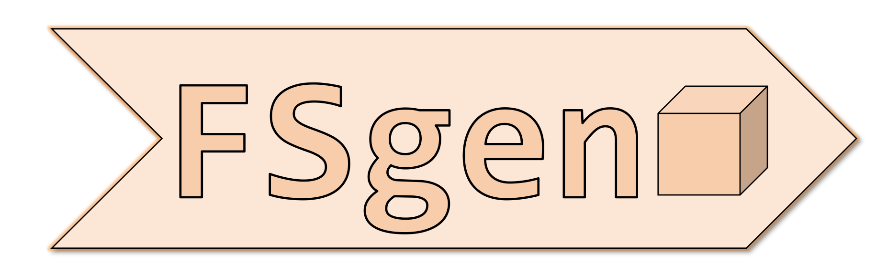

# FSGen: Agile Fused and Sparse Accelerator Generator with Accurate Power Model for LLM Applications



## Introduction and Motivation

LLM accelerators are becoming important and need specialized hardware to deliver the high performance and efficient energy requirements. The design space of modern AI chips considering sparsity, fused operation and dataflow becoming highly complex and diverse. As a result, our project FSGen provides an agile accelerator generation framework in Chisel for LLM accelerators, generating RTL code from Chisel.

We define several parameters, the sparse set and fused operator dataflow to support the design space. The sparse set consists of sparse mappings which correspond to the types of sparsity supported. The fused operator dataflow configures the tilings of each component in the accelerator, and the overall loop order, which are represented by the space-time relationship. Systolic arrays can also be represented by analysis of the space-time relationship.

Once hyper-parameters are given, FSGen will analyze the sparse sets and dataflow and map onto the corresponding architectures. We identify 4 types of sparsity hardware, i.e. compute-value, compute-group, memory-value, and memory-group. Each map differently, compute-value and group sparsity map to multicasting, unicasting, systolic crossbars. Memory-value and group sparsity map to different DMA units and their bounds. FSGen first generates the PE arrays, using the specified type of computing primitive elements (multipliers), then the PEs are connected together and the previously identified crossbars are added. Then, memory and DMA units are added, forming the overall top module.

Different types of algorithms are supported, include multi-head/group-query attention, matrix multiplication (KVQ generation), softmax and so forth. 

We also provide a toolchain for training ML-estimators for early-stage PPA estimation. 

## Installation and Prereqs.

Install SBT and Java	
    ```	
    sudo apt-get install default-jdk	
    sudo apt-get install sbt	
    ```

## How to use (Hardware Generation)

We given an example of configuring a multi-head attention fused operator dataflow unit. ```AttentionUnit.scala``` is configured by sparsity, dataflow and other parameters. Dataflow parameters include:

### Tilings
```scala
//Primary Tilings
val B1 = HardwareConfig.get("B1").getOrElse("").toInt
val N1 = HardwareConfig.get("N1").getOrElse("").toInt
val H1 = HardwareConfig.get("H1").getOrElse("").toInt
val D1 = HardwareConfig.get("D1").getOrElse("").toInt
val E1 = HardwareConfig.get("E1").getOrElse("").toInt
val M1 = HardwareConfig.get("M1").getOrElse("").toInt

val B2 = HardwareConfig.get("B2").getOrElse("").toInt
val N2 = HardwareConfig.get("N2").getOrElse("").toInt
val H2 = HardwareConfig.get("H2").getOrElse("").toInt
val D2 = HardwareConfig.get("D2").getOrElse("").toInt
val M2 = HardwareConfig.get("M2").getOrElse("").toInt

val B3 = HardwareConfig.get("B3").getOrElse("").toInt
val N3 = HardwareConfig.get("N3").getOrElse("").toInt
val H3 = HardwareConfig.get("H3").getOrElse("").toInt
val M3 = HardwareConfig.get("M3").getOrElse("").toInt
val O3 = HardwareConfig.get("O3").getOrElse("").toInt
val E3 = HardwareConfig.get("E3").getOrElse("").toInt
```

### Precisions
```scala
//Precisions
val PX  = HardwareConfig.get("PX").getOrElse("").toInt
val PWq = HardwareConfig.get("PWq").getOrElse("").toInt
val PWk = HardwareConfig.get("PWk").getOrElse("").toInt
val PWv = HardwareConfig.get("PWv").getOrElse("").toInt
	
val PQ = HardwareConfig.get("PQ").getOrElse("").toInt
val PK = HardwareConfig.get("PK").getOrElse("").toInt
val PS = HardwareConfig.get("PS").getOrElse("").toInt
val PP = HardwareConfig.get("PP").getOrElse("").toInt
val PO = HardwareConfig.get("PO").getOrElse("").toInt
val PSoftmaxFrac = HardwareConfig.get("PSoftmaxFrac").getOrElse("").toInt
	
val PV = HardwareConfig.get("PV").getOrElse("").toInt
```	
### Systolic Behavior
```scala
val XqNet = HardwareConfig.get("XqNet").getOrElse("") // MC, SYS
val XkNet = HardwareConfig.get("XkNet").getOrElse("") // MC, SYS
val XvNet = HardwareConfig.get("XvNet").getOrElse("") // MC, SYS
	
val WqNet = HardwareConfig.get("WqNet").getOrElse("") // MC, SYS
val WkNet = HardwareConfig.get("WkNet").getOrElse("") // MC, SYS
val WvNet = HardwareConfig.get("WvNet").getOrElse("") // MC, SYS
	
val QNet = HardwareConfig.get("QNet").getOrElse("") // MC, SYS
val KNet = HardwareConfig.get("KNet").getOrElse("") // MC, SYS
val SNet = HardwareConfig.get("SNet").getOrElse("") // MC, SYS
val VNet = HardwareConfig.get("VNet").getOrElse("") // MC, SYS
val ONet = HardwareConfig.get("ONet").getOrElse("") // MC, SYS
val PNet = HardwareConfig.get("PNet").getOrElse("") // MC, SYS
```

### Loop Order Configuration
Because the hardware can have configurable loop order, for simulation purposes, we set the loop order in the simulation code, found in ```AttentionUnitSpec.scala```
```scala
//Output stationary
for(b <- 0 until DimB by SB){
for(n <- 0 until DimN by SN){
for(h <- 0 until DimH by SH){
for(m <- 0 until DimM by SM){
for(d <- 0 until DimD by SD){
for(e <- 0 until DimE by SE){
``` 


### Sparsity Support
The sparsity supported is configured based on flags, enable or disable, and common sparse mappings are supported. The threshold or ratios of sparsity should also be given when necessary, i.e., for winow attention, give the bounds.

```scala
//Compute-Value Sparsity
val PhiX = HardwareConfig.get("PhiX").getOrElse("").toBool
val PhiW = HardwareConfig.get("PhiW").getOrElse("").toBool

//Compute-Group Sparsity
val PhiSparseAttenTopK = HardwareConfig.get("PhiSparseAttenTopK").getOrElse("").toBool
val WindowAttenComp = HardwareConfig.get("WindowAttenComp").getOrElse("").toBool

//Memory-Value Sparsity
val PhiXMem = HardwareConfig.get("PhiXMem").getOrElse("").toBool
val PhiWMem = HardwareConfig.get("PhiWMem").getOrElse("").toBool

//Memory-Group Sparsity
val WindowAttenMem = HardwareConfig.get("WindowAttenMem").getOrElse("").toBool
```

### Other Parameters

Other parameters include sizing the queues and caches.
```scala
val PQCache = HardwareConfig.get("PQCache").getOrElse("").toInt //6 (64), 8 (256), 10 (1024), 16 (64KB), 
val PKCache = HardwareConfig.get("PKCache").getOrElse("").toInt //6 (64), 8 (256), 10 (1024), 16 (64KB), 
val PVCache = HardwareConfig.get("PVCache").getOrElse("").toInt //6 (64), 8 (256), 10 (1024), 16 (64KB), 
val PPCache = HardwareConfig.get("PPCache").getOrElse("").toInt //6 (64), 8 (256), 10 (1024), 16 (64KB), 
val POCache = HardwareConfig.get("POCache").getOrElse("").toInt //6 (64), 8 (256), 10 (1024), 16 (64KB), 
	
val PSCache = HardwareConfig.get("PSCache").getOrElse("").toInt //6 (64), 8 (256), 10 (1024), 16 (64KB),
```

### Generate Verilog and Testbench

To run the verilog and testbench, run ```sbt "test:runMain units.MHAV1Spec``` which runs a version of the multi-head attention hardware. Verilog will also be generated for the unit automatically. Other parameters such as technology, clock frequency, output capacitances are also set in ```AttentionUnitSpec.scala```.

## How to use (Power ML early-stage Estimation)
Apart from hardware generation, FSGen also supports early-stage power estimation of any level of the hardware hierarchy (top-level, module-level, primitive-level), but focused on primitives due to our primitive-level power estimator. First, run ```sbt "test:runMain *"``` for the required chisel module, then set up the input data test vectors correspondingly. For example, below are two example of testing vectors for a two-input (dim=2) module such as a multiplier.
```scala
val TestVectorMap = Helper.GenSimpleTrainingVectors(mode="bits_no_zero", p=8, dim=2)
val TestVectorMap = Helper.GenSimpleTrainingVectors(mode="random", p=8, dim=2)
```
Ensure that ```val EDAVerification = true```. 

Once run, the results will be outputed in the ```generated``` folder.

To train the ML estimators, for example for multipliers, run:

```
sbt "test:runMain multipliers.Multiplier2Spec"
python3 src/main/python/train_primitives.py Multiplier2 train
```

This will train a space of mutlipliers and get their PPA (power, latency, area etc.) and train the primitives for each of these PPA.
